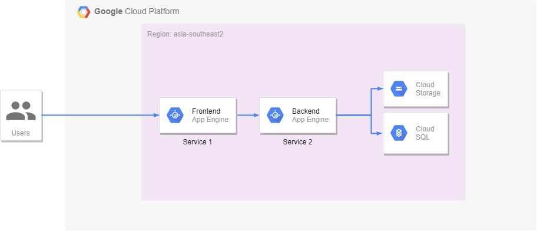
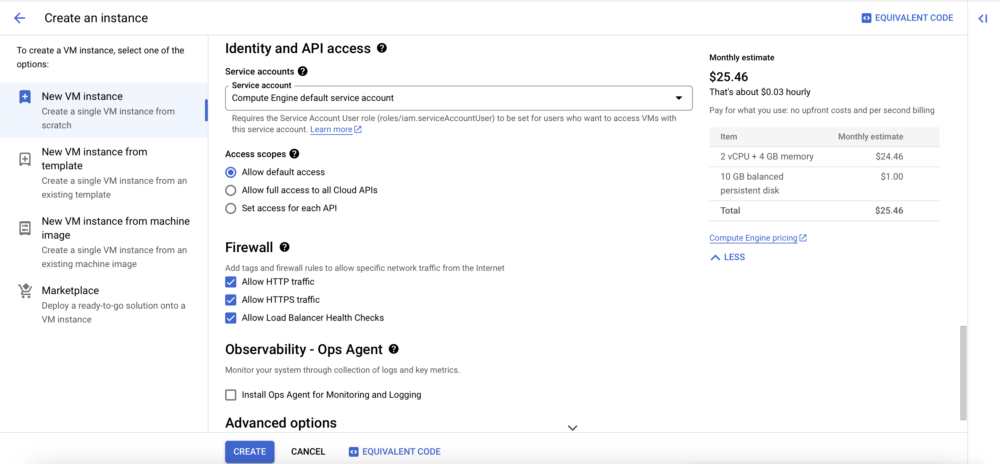
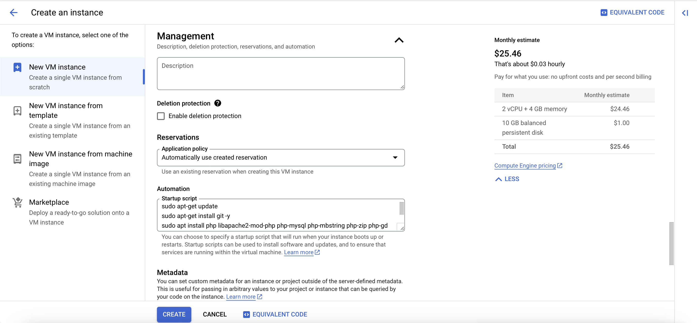

Disini kita akan mendeploy sebuah aplikasi (Frontend) memakai CodeIgniter 3 dan Backend memakai Node.js. Dalam case ini kita membuat skenario seperti berikut :

- [Skenario](#skenario)
- [Arsitektur](#arsitektur)
- [Langkah-langkah](#tutorial)

## Skenario

- Front-End Web ditulis menggunakan PHP dengan framework CodeIgniter versi 3.1.10.
- Back-End API ditulis menggunakan Node.js.

## Arsitektur



- Front-End akan di deploy memakai Google Cloud Compute Engine
- Back-End akan di deploy memakai Google App Engine
- Storage akan di deploy memakai Google Cloud Bucket Storage
- Database akan di deploy memakai Google Cloud SQL

## Tutorial

### Front-End

Setting Virtual Machine Seperti Berikut:

_Semua settingan default kecuali pada bagian dibawah ini._

**Aktifkan Firewall:**

- Http
- Https
- Load Balancer and Health Check



**Konfigurasi Script Autorun:**

1. Pada menu Advanced Option, pilih Management
2. Masukan script berikut

```
sudo apt-get update
sudo apt-get install git -y
sudo apt install php libapache2-mod-php php-mysql php-mbstring php-zip php-gd php-json php-curl -y
sudo apt-get install apache2 -y
```

Keterangan:

1. _sudo apt-get update_ untuk update
2. _sudo apt-get install git_ untuk menginstall git (karena kita akan cloning dari github) dan _-y_ untuk agree/setuju dalam menginstall tersebut
3. _sudo apt install php_ untuk menginstall php serta segala macam librarynya _libapache2-mod-php php-mysql php-mbstring php-zip php-gd php-json php-curl_ dan _-y_ untuk agree/setuju dalam menginstall tersebut
4. _sudo apt-get install apache2_ untuk menginstall server yang akan kita gunakan, disini menggunakan apache2 dan _-y_ untuk agree/setuju dalam menginstall tersebut




### Konfigurasi Server

File: 000-default.conf

Path: /etc/apache2/sites-available

```bash
<VirtualHost *:80>
	# The ServerName directive sets the request scheme, hostname and port that
	# the server uses to identify itself. This is used when creating
	# redirection URLs. In the context of virtual hosts, the ServerName
	# specifies what hostname must appear in the request's Host: header to
	# match this virtual host. For the default virtual host (this file) this
	# value is not decisive as it is used as a last resort host regardless.
	# However, you must set it for any further virtual host explicitly.
	#ServerName www.example.com

	ServerAdmin webmaster@localhost
	DocumentRoot /var/www/html

	# Available loglevels: trace8, ..., trace1, debug, info, notice, warn,
	# error, crit, alert, emerg.
	# It is also possible to configure the loglevel for particular
	# modules, e.g.
	#LogLevel info ssl:warn

	<Directory /var/www/html>
        	Options Indexes FollowSymLinks
        	AllowOverride All
        	Require all granted
    </Directory>

	ErrorLog ${APACHE_LOG_DIR}/error.log
	CustomLog ${APACHE_LOG_DIR}/access.log combined

	# For most configuration files from conf-available/, which are
	# enabled or disabled at a global level, it is possible to
	# include a line for only one particular virtual host. For example the
	# following line enables the CGI configuration for this host only
	# after it has been globally disabled with "a2disconf".
	#Include conf-available/serve-cgi-bin.conf
</VirtualHost>

# vim: syntax=apache ts=4 sw=4 sts=4 sr noet
```

File: .htaccess

Path: /var/www/html

```bash
RewriteEngine On
#RewriteBase /
RewriteCond %{REQUEST_FILENAME} !-f
RewriteCond %{REQUEST_FILENAME} !-d
RewriteRule (.*) index.php/$1
```

```
sudo a2ensite 000-default.conf
sudo a2enmod rewrite
sudo systemctl restart apache2
```