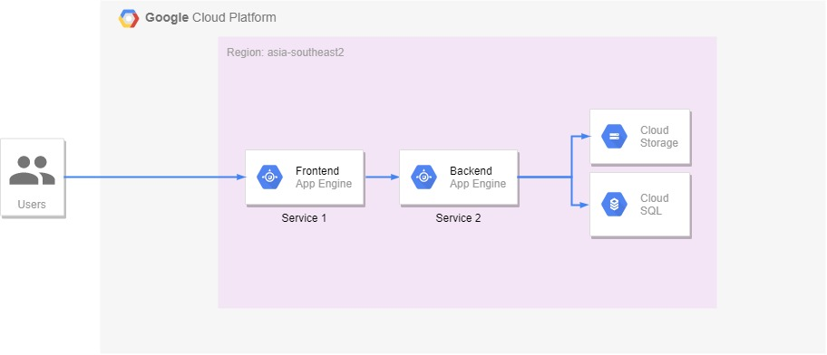

Disini kita akan mendeploy sebuah aplikasi (Frontend) memakai CodeIgniter 3 dan API (Backend) memakai Node.js. Dalam case ini kita membuat skenario seperti berikut :

- [Skenario](#skenario)
- [Arsitektur](#arsitektur)
- [Langkah-langkah](#tutorial)

## Skenario

- Front-End Web ditulis menggunakan PHP dengan framework CodeIgniter versi 3.1.10.
- Back-End API ditulis menggunakan Node.js.

## Arsitektur



- Front-End akan di deploy memakai Google Cloud Compute Engine
- Back-End akan di deploy memakai Google App Engine
- Storage akan di deploy memakai Google Cloud Bucket Storage
- Database akan di deploy memakai Google Cloud SQL

## Tutorial

### Front-End

Setting Virtual Machine Seperti Berikut:

_Semua settingan default kecuali pada bagian dibawah ini._

**Aktifkan Firewall:**

- Http
- Https
- Load Balancer and Health Check (Opsional)


**Konfigurasi Script Autorun:**

1. Pada menu Advanced Option, pilih Management
2. Masukan script berikut:

```
sudo apt-get update
sudo apt-get install git -y
sudo apt install php libapache2-mod-php php-mysql php-mbstring php-zip php-gd php-json php-curl -y
sudo apt-get install apache2 -y
```

Keterangan:

1. _sudo apt-get update_ untuk update
2. _sudo apt-get install git_ untuk menginstall git (karena kita akan cloning dari github) dan _-y_ untuk agree/setuju dalam menginstall tersebut (github opsional bisa memakai lainnya)
3. _sudo apt install php_ untuk menginstall php serta segala macam librarynya _libapache2-mod-php php-mysql php-mbstring php-zip php-gd php-json php-curl_ dan _-y_ untuk agree/setuju dalam menginstall tersebut (library opsional)
4. _sudo apt-get install apache2_ untuk menginstall server yang akan kita gunakan, disini menggunakan apache2 dan _-y_ untuk agree/setuju dalam menginstall tersebut


### Konfigurasi Server

1. **File:** 000-default.conf

	**Path:** /etc/apache2/sites-available

```bash
<VirtualHost *:80>

	ServerAdmin webmaster@localhost
	DocumentRoot /var/www/html

	<Directory /var/www/html>
        	Options Indexes FollowSymLinks
        	AllowOverride All
        	Require all granted
    </Directory>

	ErrorLog ${APACHE_LOG_DIR}/error.log
	CustomLog ${APACHE_LOG_DIR}/access.log combined

</VirtualHost>

# vim: syntax=apache ts=4 sw=4 sts=4 sr noet
```

2. **File:** .htaccess

	**Path:** /var/www/html

```bash
RewriteEngine On
#RewriteBase /
RewriteCond %{REQUEST_FILENAME} !-f
RewriteCond %{REQUEST_FILENAME} !-d
RewriteRule (.*) index.php/$1
```

3. Ketikan pada terminal:

```
sudo a2ensite 000-default.conf
sudo a2enmod rewrite
sudo systemctl restart apache2
```

Keterangan:

- _sudo a2ensite 000-default.conf_ untuk memastikan perubahan terhadap file 000-default.conf telah di terapkan
- _sudo a2enmod rewrite_ untuk memastikan perubahan terhadap file .htaccess telah di terapkan
- _sudo systemctl restart apache2_ merestart server apache agar memperbaharui tampilan

### Note

Pastikan **Base URL** pada CodeIgniter sudah benar dan jika memakai API Backend pastikan Endpoint/URL sudah benar.

## Selesai