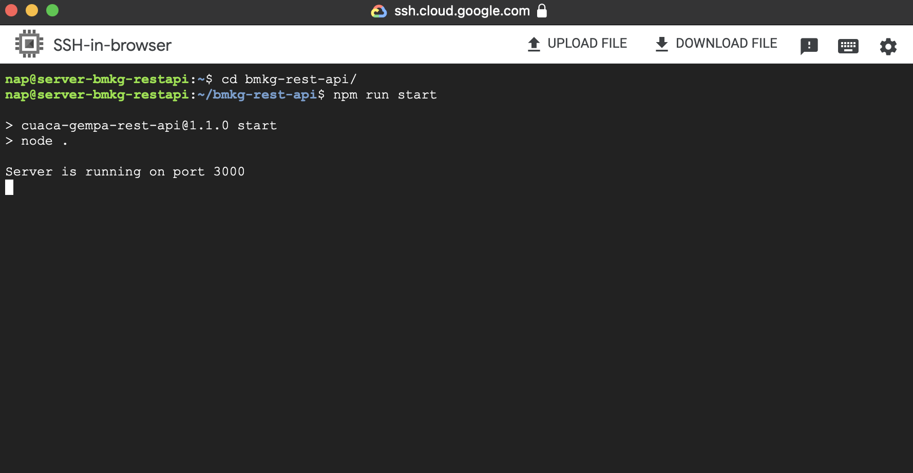
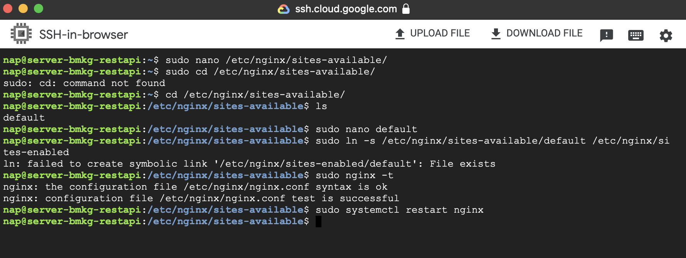
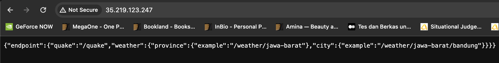

## Daftar Isi

- [Membuat VM Instance](#membuat-mesin-vm-instance)
- [Download Nodejs dan NPM](#download-nodejs-dan-npm)
- [Konfigurasi Aplikasi](#konfigurasi-app-server)
- [Konfigurasi Nginx](#konfigurasi-nginx-proxy-server)

## Membuat Mesin VM Instance

Membuat VM Instance pergi ke ```Compute Engine -> VM Instance -> Create Instance```.

Buat dengan spesifikasi: 

  - Nama : (Bebas)
  - Region : (Bebas)
  - Machine configuration: (Bebas)
  - Boot Disk : Debian GNU/Linux 11 (bullseye)
  - Firewall : Allow HTTP traffic
  - Networking : Kalau bisa menggunakan Ipv4 Eksternal Static (Agar tidak berubah)
  - Management : Startup script isikan seperti dibawah

```
sudo apt-get update
sudo apt-get install git -y
sudo apt-get install nginx -y
```

Setelah itu create.

Masuk menggunakan SSH atau terserah kalian yang penting nyaman enjoy.

## Download Nodejs dan NPM

Sesuaikan ```versi 16.x``` kalau kalian mau pake versi 20.x atau berapa juga boleh. Arti x berarti latest atau paling terakhir, misal 16.x berarti 16.versi terakhir.

```
cd ~
curl -sL https://deb.nodesource.com/setup_16.x -o /tmp/nodesource_setup.sh
```

Lakukan pengecekan, jika sudah sesuai maka sudah. Keluar saja CTRL + X terus y dan enter.

```
nano /tmp/nodesource_setup.sh
```

Jalankan installasi, tunggu beberapa menit

```
sudo bash /tmp/nodesource_setup.sh
```

```
sudo apt install nodejs
```

Cek versi

```
node -v
```

```
npm -v
```

## Konfigurasi App Server

Kita akan mengkonfigurasikan aplikasi, saya memakai kode punya saya. Kalian pake yang punya kalian sendiri atau yang punya saya juga boleee...

Download [disini](https://github.com/Naffsisky/bmkg-rest-api.git).

```
git clone [link](https://github.com/Naffsisky/bmkg-rest-api.git)
```

Masuk ke directory dan install npm

```
cd <nama_file>
npm i
```

Setelah menginstall semua kebutuhan, pastikan server atau aplikasi sudah berjalan dengan lancar.

Lalu kembali ke directory utama

```
cd ~
```

Kita akan menjalankan menggunakan screen, dengan perintah:

```
screen -S <nama_bebas>
```

Misal

```
screen -S app
```

Lalu jalankan aplikasi seperti biasa



Lalu kita detach atau ke screen utama dengan perintah ```CTRL + A + D```.

Kita coba test dengan curl

```
curl localhost:port
```

Jika sudah jalan, lanjut ke step berikutnya.

## Konfigurasi Nginx Proxy Server

Kita akan menuju folder setting nginx

```
cd /etc/nginx/sites-available/
```

Cek file, kalo di saya bernama default

```
ls
```

Lalu masukan script

```bash
server {
  listen 80 default_server;
  listen [::]:80 default_server;

  server_name 35.219.123.247;

  location / {
    proxy_pass http://localhost:3000;
    proxy_set_header Host $host;
    proxy_set_header X-Real-IP $remote_addr;
    proxy_set_header X-Forwarded-For $proxy_add_x_forwarded_for;
    proxy_set_header X-Forwarded-Proto $scheme;
    # First attempt to serve request as file, then
    # as directory, then fall back to displaying a 404.
    try_files $uri $uri/ =404;
  }
}
```

Setelah itu gunakan perintah

```
sudo nginx -t
```

Pastikan sudah ok dan successful.

Lalu restart Nginx

```
sudo systemctl restart nginx
```



Kita cek aplikasinya dengan copy IP Eksternal VM.



## Selesai